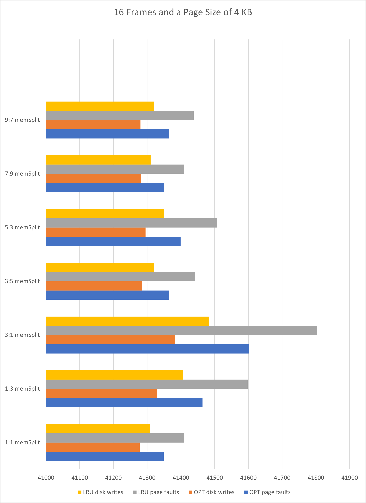
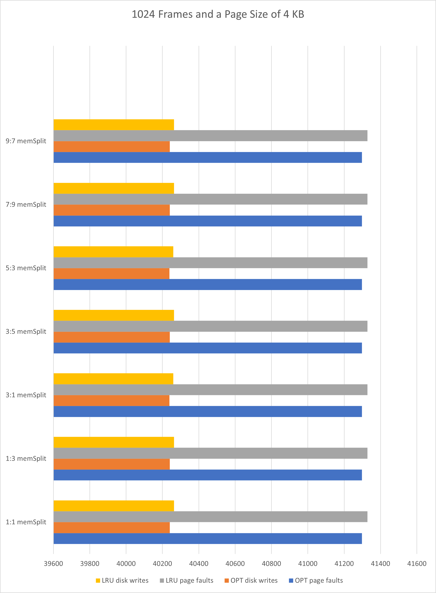
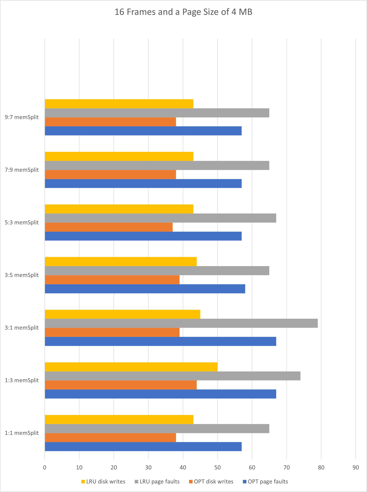
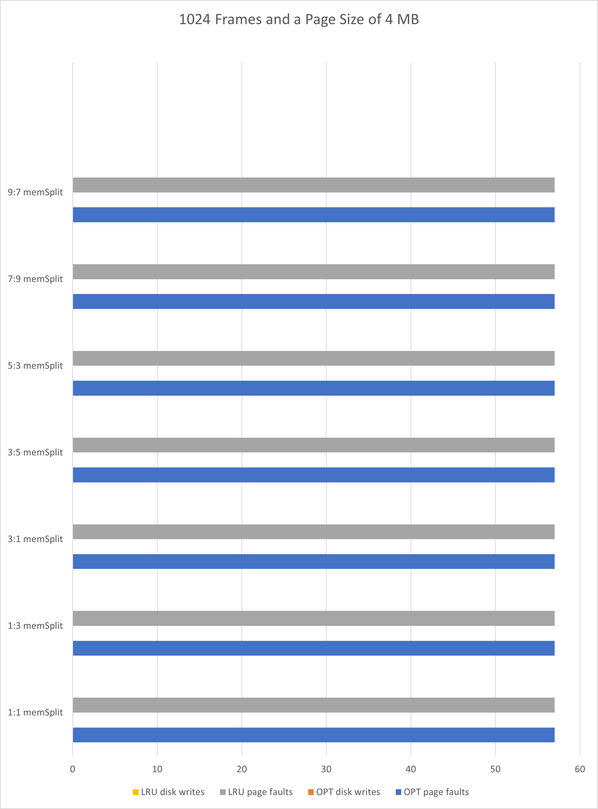

# Project 3 Writeup
## By: Matt Semmel

Ran all memory configurations, page sizes, and number of frames on the 2-gzip-mcf trace. Graphs are attached below in the next section.

We can see that increasing the number of frames reduces the number of page faults in both the OPT and LRU algorithms. However, the biggest reduction in page faults came from increasing the size of pages. As we can see from the graphs, increasing the page size from 4 KB to 4 MB reduced the number of page faults from more than 40,000 to less than 100 across both algorithms and all memory splits.

Additionally, while LRU has only slightly worse performance across MOST (not all) configurations, OPT is the ideal algorithm to use.

# Graphs!

